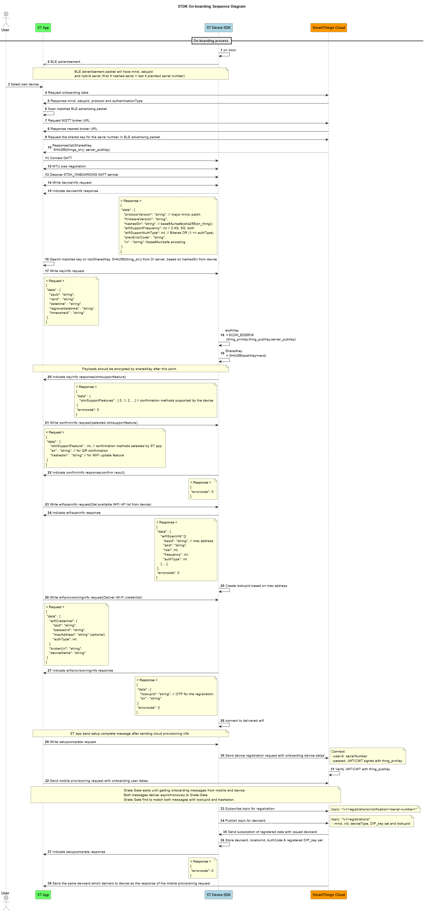

# BLE Onboarding (ED25519)

## Table of Contents

- [Device Requirement](#device-requirement)
- [Discovery Advertisement Packet](#discovery-advertisement-packet)
  - [Advertise Interval](#advertise-interval)
  - [Packet Format](#packet-format)
- [Device to Device Communication](#device-to-device-communication)
  - [GATT Service](#gatt-service)
  - [GATT Characteristics](#gatt-characteristics)
  - [BLE Communication Sequence Diagram](#ble-communication-sequence-diagram)
- [Payload Transfer Format](#payload-transfer-format)
  - [Command Format](#command-format)
- [BLE Onboarding Sequence Flow](#ble-onboarding-sequence-flow)
- [Offline Diagnostics](#offline-diagnostics)
- [Onboarding Error Code](#onboarding-error-code)

---

## Device Requirement

- Device should use the **same BLE address** during its lifetime to support ST app features.
- It should support security storage to protect device information.

---

## Discovery Advertisement Packet

### Advertise Interval

**50 ms**

### Packet Format

#### For ED25519 Raw Key Device

Use **16-bit UUID (0xFD1D)** as GATT service UUID.

**ADV_IND**

| Field | Value | Description |
|---|---|---|
| Company ID | `0x0075` | Samsung Electronics |
| Control & Version | `0x42` | Active Scan Required |
| Service ID | `0x0C` | Samsung Connect |
| Samsung Connect Packet Version | `0x83` | |
| OCF info | `0x05` | Onboarding Ready, Onboarding Support |
| OCF info (owned) | `0x03` | Onboarded, WIFI update Support, Offline diagnostics Support |
| Feature | `0x59` | Custom Data, Address, Setup Available Network, Setup Info |
| Setup Available Network | `0x04` | BLE |
| Address Transfer | `0x01` | BT Address |
| Setup Info | `mnid`, `setupId` | From DevWS (`onboarding_config.json`) |
| Custom Data Length | `0x0A` | Data length |
| Custom Type | `0x03` | Hybrid serial number Support |
| Custom Type data len | `0x08` | Hybrid serial number length |
| Custom Type Data | — | Hybrid serial number data |

**OCF info bit definition:**

- `[2]` Onboarding ready (0: not ready, 1: ready)
- `[1]` Owned state (0: unowned, 1: owned)
- `[0]` Onboarding Supported (0: not supported, 1: supported)

**SCAN_RSP**

| Field | Value |
|---|---|
| Device Name Data | Model Name from DevWS |

---

## Device to Device Communication

### GATT Service

| Name | UUID |
|---|---|
| SMARTTHINGS_SDK_SETUP | `0xFD1D` (registered at bluetooth.com assigned numbers) |

### GATT Characteristics

| UUID | Name | Description | Property | CCCD |
|---|---|---|---|---|
| `BE940F0E-AE2D-4F8E-A4C7-300280E60E09` | SDK_SETUP | Common characteristic for SmartThings SDK direct connected device onboarding | Write / Indication | Indication: Yes, Notification: No |

## Payload Transfer Format

- Only **segmented data** is encrypted
- MTU range: **23 byte < MTU size < 517 byte**
  - MTU default size is 23 bytes (most chipsets use this as minimum)
  - MTU max size is 517 bytes (GATT Attribute Value max: 512 bytes + GATT Attribute Header max: 5 bytes)
- If the payload is too large, it may be transferred as **chunk data** (encrypted per chunk unit)

### First Transfer Data

| Field | Data type | Offset | Length | Value |
|---|---|---|---|---|
| seqNumber | uint8 | 0 | 1 byte | Sequence number of current command segment, starting from `0x00` |
| cmd | uint8 | 1 | 1 byte | Command number |
| transactionId | uint8 | 2 | 1 byte | Increases by 1 per transaction; count resets per onboarding section |
| totalSize | uint32 | 3 | 3 bytes | Total transferred segmentedData size |
| chunkDataContinued | uint8 | 6 | 1 byte | `0`: last data chunk; `N (non-0)`: N more continuous data chunks follow |
| segmentedDataLength | uint16 | 7 | 2 bytes | Segmented data length |
| segmentedData | byte array | 9 | delivered data length | Must be separated by MTU size |

### Next Transfer Data

| Field | Data type | Offset | Length | Value |
|---|---|---|---|---|
| seqNumber | uint8 | 0 | 1 byte | Increases by 1 for each additional MTU-size segment (e.g. `0x01`, `0x02`, ...) |
| cmd | uint8 | 1 | 1 byte | Command number |
| transactionId | uint8 | 2 | 1 byte | Increases by 1 per transaction |
| offset | uint32 | 3 | 3 bytes | Start offset of this segment in the total data |
| segmentedDataContinued | uint8 | 6 | 1 byte | `0`: last segment; `N (non-0)`: N more segments follow |
| segmentedDataLength | uint16 | 7 | 2 bytes | Segmented data length |
| segmentedData | byte array | 9 | delivered data length | Must be separated by MTU size |

### Command Format

#### Overview

| Cmd# | Mobile → Device | Device → Mobile | Encryption |
|:---:|---|---|:---:|
| 1 | DeviceInfo (Write) | DeviceInfoResponse (Indicate) | No |
| 2 | KeyInfo (Write) | KeyInfoResponse (Indicate) | No → **Yes** |
| 3 | ConfirmInfo (Write) | ConfirmInfoResponse (Indicate) | Yes |
| 4 | Confirm (Write) | ConfirmResponse (Indicate) | Yes |
| 5 | Wifiscaninfo (Write) | WifiScaninfoResponse (Indicate) | Yes |
| 6 | Wifiprovisioninginfo (Write) | WifiprovisioninginfoResponse (Indicate) | Yes |
| 7 | Tncagreements (Write) | TncagreementsResponse (Indicate) | Yes |
| 8 | Setup Complete (Write) | Setup Complete Response (Indicate) | Yes |
| 9 | log/systeminfo (Write) | SysteminfoResponse (Indicate) | No |

> Encryption column indicates both directions. Cmd 2: Mobile→Device is **No**, Device→Mobile is **Yes**.

---

#### Cmd 1 — DeviceInfo

Mobile → Device: no payload required.

Device → Mobile response fields:

| Field | M/O | Description |
|---|:---:|---|
| `protocolVersion` | M | |
| `firmwareVersion` | M | |
| `countryInfo` | O | |
| `hashedSn` | M | |
| `wifiSupportFrequency` | M | See table below |
| `wifiSupportAuthType` | M | See table below |
| `prevErrorCode` | M | |
| `iv` | M | |

**wifiSupportFrequency:**

| Value | Description |
|:---:|---|
| 0 | 2.4G only |
| 1 | 5G only |
| 2 | 2.4G / 5G both |

**authType** (Bitwise OR for multi-auth):

| Value | Auth Type |
|:---:|---|
| 0 | Open |
| 1 | WEP |
| 2 | WPA-PSK |
| 3 | WPA2-PSK |
| 4 | WPA-WPA2-PSK |
| 5 | EAP |
| 6 | WPA3-Personal (SAE) |
| 7 | WPA-FT-PSK |
| 8 | WPA-PSK-SHA256 |

---

#### Cmd 2 — KeyInfo

Mobile → Device request fields (Encryption: No):

| Field | M/O |
|---|:---:|
| `spub` | M |
| `rand` | M |
| `datetime` | O |
| `regionaldatetime` | O |
| `timezoneid` | O |

Device → Mobile response fields (Encryption: Yes):

| Field | M/O | Description |
|---|:---:|---|
| `otmSupportFeatures` | M | See table below |

**otmSupportFeatures:**

| Value | OTM Method |
|:---:|---|
| 0 | Just works |
| 1 | Support QR Code Confirm Skip |
| 2 | Support Button Confirm |
| 3 | Support PIN Number Confirm |
| 4 | Support Serial Number Confirm |
| 5 | Support Ultra Sound Confirm |
| 6 | Support Hashed Serial Number Confirm |

**Basic OTM Priority by ST app:**

1. Just works (0)
2. QR Code Confirm Skip (1) / Serial Number Confirm (4) / Hashed Serial Number Confirm (6)
3. Button Confirm (2)
4. PIN Confirm (3)

---

#### Cmd 3 — ConfirmInfo

Mobile → Device request fields (Encryption: Yes):

| Field | M/O | Description |
|---|:---:|---|
| `otmSupportFeature` | M | Selected OTM method |
| `sn` | O | Mandatory for QR |
| `hashedsn` | O | |

Device → Mobile response: `confirmed` or `rejected` (M)

---

#### Cmd 4 — Confirm

Mobile → Device request (Encryption: Yes):

| Field | M/O | Description |
|---|:---:|---|
| `pin` | M | String of 8 digits |

Device → Mobile response: Success / Error

---

#### Cmd 5 — Wifiscaninfo

Mobile → Device request (Encryption: Yes):

| Field | M/O | Description |
|---|:---:|---|
| `mobileWifiCredential` | O | Transferred only if a candidate SSID is available for the device |
| └ `ssid` | O | |
| └ `password` | O | |
| └ `macAddress` | O | |
| └ `frequency` | O | |
| └ `authType` | O | |

Device → Mobile response fields:

| Field | M/O |
|---|:---:|
| `bssid` | M |
| `ssid` | O |
| `hexSsid` | M |
| `rssi` | M |
| `frequency` | M |
| `authType` | M |

---

#### Cmd 6 — Wifiprovisioninginfo

Mobile → Device request (Encryption: Yes):

| Field | M/O | Description |
|---|:---:|---|
| `ssid` | M | |
| `hexSsid` | O | Mandatory if `hexSsid` was present in Wifiscaninfo response |
| `password` | O | |
| `macAddress` | O | |
| `authType` | O | |
| `hiddenSSID` | M | `0`: not hidden, `1`: hidden |
| `brokerURL` | M | |
| `deviceName` | O | |

Device → Mobile response fields:

| Field | M/O |
|---|:---:|
| `lookupId` | M |
| `tncUrl` | O |
| `sn` | O |

---

#### Cmd 7 — Tncagreements

> Only sent when Wifiprovisioninginfo response includes `tncUrl`.

Mobile → Device request (Encryption: Yes):

| Field | M/O |
|---|:---:|
| `agreements` | M |

Device → Mobile response: Success / Error

---

#### Cmd 8 — Setup Complete

No payload in either direction. Both sides respond Success / Error.

---

#### Cmd 9 — log/systeminfo

Mobile → Device: no payload (Encryption: No).

Device → Mobile response:

| Field | M/O |
|---|:---:|
| `version` | M |

---

## BLE Onboarding Sequence Flow



---

## Offline Diagnostics

#### Overview

| Cmd# | Mobile → Device | Device → Mobile | Encryption |
|:---:|---|---|:---:|
| 10 | log/dump (Write) | DumpResponse (Indicate) | No |
| 11 | connectionInfo (Write) | connectionInfoResponse (Indication) | Yes |
| 12 | recoveryCommand (Write) | Response recoveryCommand (Indication) | Yes |
| 13 | Monitor ethernet cable attached event (Write) | Response ethernet cable attached event (Indication) | Yes |

---

#### Cmd 10 — log/dump

**Mobile → Device (Write, No Encryption)** — No payload

---

**Device → Mobile (Indicate, No Encryption)**

```
raw data format transfer (Byte array)
log dump size: 2K byte
```

---

#### Cmd 11 — connectionInfo

**Mobile → Device (Write, Encrypted)** — No payload

---

**Device → Mobile (Indication, Encrypted)**

| Field | M/O |
|---|:---:|
| `version` | M |
| `connectionInfo` | M |

Success:
```json
{
  "data": {
    "version": "1.0",
    "connectionInfo": {
      "last_error_code": "CE01",
      "ap_mac": "xx:xx:xx:xx:xx:xx",
      "conn_rssi": "-43"
    }
  },
  "errorcode": 0
}
```

---

#### Cmd 12 — recoveryCommand

**Mobile → Device (Write, Encrypted)**

| Field | M/O |
|---|:---:|
| `command` | M |

**restartThing** — Restart the device:
```json
{
  "data": {
    "command": "restartThing"
  }
}
```

**updateWifi** — Deliver new WiFi credentials (user selection):
```json
{
  "data": {
    "command": "updateWifi",
    "wifiCredential": {
      "ssid": "string",
      "password": "string",
      "macAddress": "string",
      "authType": 0,
      "hiddenSSID": 0,
      "hexSsid": "string"
    }
  }
}
```

> - `hiddenSSID`: `0` = No Hidden, `1` = Hidden
> - If Wifiscaninfo Response includes `hexSsid`, then `hexSsid` is mandatory; otherwise optional.

---

**Device → Mobile (Indication, Encrypted)**

Success:
```json
{
  "errorcode": 0
}
```

Error:
```json
{
  "errorcode": 0
}
```

> For `updateWifi` request failures, use the same response codes as the `WifiprovisioningInfo` command (see Error Code section below)

---

#### Cmd 13 — Monitor ethernet cable attached event

**Mobile → Device (Write, Encrypted)**

| Field | M/O | Description |
|---|:---:|---|
| `timeout` | M | Time (seconds) to wait for Ethernet cable attach event |

```json
{
  "data": {
    "timeout": 300
  }
}
```

> Example: `"timeout": 300` → device waits 5 minutes for cable attach event.

---

**Device → Mobile (Indication, Encrypted)**

Success:
```json
{
  "errorcode": 0
}
```

| Success Case | Description |
|---|---|
| Already attached | Ethernet cable is already connected; device responds immediately |
| Ethernet cable attached | Device monitors connection; responds immediately when cable is connected |

Error:
```json
{
  "errorcode": 0
}
```

| Error Case | Error Code | Description |
|---|---|---|
| Timeout | `544` (NOT_CONNECTED_NETWORK_WIRED) | No cable connection event within the specified timeout |
| Not Supported Ethernet | `401` (INVALID_CMD) | Device does not support Ethernet cable connection |
| Etc error | `501` (INTERNAL_SERVER_ERROR) | Device cannot monitor Ethernet cable for some reason |

---

## Onboarding Error Code

Error code is returned in the response body payload:

```json
{
    "error": {
        "code": <int>
    }
}
```
The onboarding error codes are defined in [iot_easysetup.h](../src/include/iot_easysetup.h) header file.
| HTTP Status | Category | Error Code | Code Number |
|---|---|---|---|
| 400 Bad Request | Common | INVALID_CMD | 401 |
| 400 Bad Request | Common | INVALID_REQUEST | 402 |
| 400 Bad Request | Common | INVALID_SEQUENCE | 403 |
| 400 Bad Request | Common | BASE64_DECODE_ERROR | 405 |
| 400 Bad Request | Common | AES256_DECRYPTION_ERROR | 406 |
| 500 Internal Server Error | Common | INTERNAL_SERVER_ERROR | 501 |
| 500 Internal Server Error | Common | JSON_CREATE_ERROR | 502 |
| 500 Internal Server Error | Common | BASE64_ENCODE_ERROR | 504 |
| 500 Internal Server Error | Common | AES256_ENCRYPTION_ERROR | 505 |
| 500 Internal Server Error | Common | FAILED_CREATE_LOG_ERROR | 506 |
| 400 Bad Request | Key Info | RAND_DECODE_ERROR | 411 |
| 500 Internal Server Error | Key Info | RPK_NOT_FOUND | 511 |
| 500 Internal Server Error | Key Info | SHARED_KEY_CREATION_FAIL | 512 |
| 500 Internal Server Error | Key Info | RANDOM_CREATION_FAIL | 513 |
| 500 Internal Server Error | Key Info | CERTIFICATION_PEM_SUB_GET_FAIL | 514 |
| 500 Internal Server Error | Key Info | CERTIFICATION_PEM_DEVICE_GET_FAIL | 515 |
| 500 Internal Server Error | Key Info | LOCAL_PUBLICKEY_GET_FAIL | 516 |
| 500 Internal Server Error | Key Info | LOCAL_SIGNATURE_GET_FAIL | 517 |
| 400 Bad Request | OTM | INVALID_QR | 421 |
| 400 Bad Request | OTM | INVALID_SERIAL_NUMBER | 422 |
| 400 Bad Request | OTM | INVALID_PIN | 423 |
| 500 Internal Server Error | OTM | CONFIRM_NOT_SUPPORT | 521 |
| 500 Internal Server Error | OTM | CONFIRM_TIMEOUT | 522 |
| 500 Internal Server Error | OTM | SERIAL_NOT_FOUND | 523 |
| 500 Internal Server Error | OTM | CONFIRM_DENIED | 524 |
| 400 Bad Request | WiFi Provisioning | INVALID_MAC | 431 |
| 400 Bad Request | WiFi Provisioning | INVALID_BROKER_URL | 432 |
| 500 Internal Server Error | WiFi Provisioning | WIFI_SCAN_LIST_NOT_FOUND | 531 |
| 500 Internal Server Error | WiFi Provisioning | WIFI_NOT_DISCOVERED | 536 |
| 500 Internal Server Error | WiFi Provisioning | WIFI_INVALID_PASSWORD | 537 |
| 500 Internal Server Error | WiFi Provisioning | WIFI_INVALID_SSID | 538 |
| 500 Internal Server Error | WiFi Provisioning | WIFI_INVALID_AUTH_TYPE | 539 |
| 500 Internal Server Error | WiFi Provisioning | WIFI_INVALID_BSSID | 540 |
| 500 Internal Server Error | WiFi Provisioning | WIFI_DHCP_FAILURE | 545 |
| 500 Internal Server Error | Registration | REGISTER_FAILED_REGISTRATION | 541 |
| 500 Internal Server Error | Registration | UNAVAILABLE_PASSWORD | 542 |
| 500 Internal Server Error | Registration | NOT_CONNECTED_NETWORK | 543 |
| 500 Internal Server Error | Registration | NOT_CONNECTED_WIRED_NETWORK | 544 |
