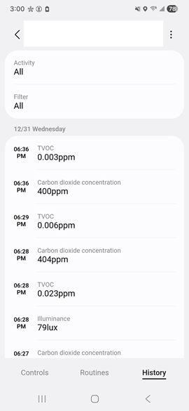

# Capability Attribute Update
Capability is the basic data model in the SmartThings IoT ecosystem. Therefore, for your device to work with SmartThings, you first need to model your device using Capabilities as a base. To acquire Capability data model knowledge, please visit [SmartThings Developers site](https://developer.smartthings.com/docs/devices/capabilities/) and check.

After modeling your device with several Capabilities, you can map your device's status with each Capability's Attribute. So your device's status can be expressed with several Capability Attribute values. SmartThings Mobile App renders the value to appropriate UI/UX and shows users current device's status with it. For example, assuming your device is power switch and you model it with [Switch Capability](https://developer.smartthings.com/docs/devices/capabilities/capabilities-reference#switch). And if the device's power status is off, you can update the device's Switch Capability's switch attribute with "off" value. Users can check the device's status on SmartThings Mobile App device page.

***

## How to update Capability Attribute using the SDK

In the SDK, we provide the following APIs for a device to update its Capability Attribute.

```c
IOT_EVENT *st_cap_create_attr(IOT_CAP_HANDLE *cap_handle, const char *attribute, iot_cap_val_t *value, const char *unit,
                              const char *data);
int st_cap_send_attr(IOT_EVENT *event[], uint8_t evt_num);
void st_cap_free_attr(IOT_EVENT *event);
```

First, you can create a Capability Attribute with `st_cap_create_attr()`. Then, you can update the Capability Attribute with `st_cap_send_attr()`. After finishing update, you need to free the created Capability Attribute data with `st_cap_free_attr()` to prevent memory leak.

### Updating Capability Attribute Example

Assuming there is a power switch device with Switch Capability. When a user flips the power switch from off to on, the device wants to update its status to "on" in the cloud. Here is device app example code.

```c
int output_seq_num;
IOT_EVENT *attr = NULL;
iot_cap_val_t value;

value.type = IOT_CAP_VAL_TYPE_STRING;
value.string = "on";
attr = st_cap_create_attr(switch_cap_handle, "switch", &value, NULL, NULL); // switch_cap_handle is defined ahead
if (attr != NULL) {
    output_seq_num = st_cap_send_attr(&attr, 1);
    st_cap_free_attr(attr);
}
```

In above example, `switch_cap_handle` is defined ahead with Switch Capability. According to the [documentation](https://developer.smartthings.com/docs/devices/capabilities/capabilities-reference#switch), the "switch" Attribute of the Switch Capability has enum STRING values ("off", "on"). So it sets value type with STRING and string value with "on". "switch" Attribute doesn't have any Unit and Data options, so set NULL for both parameters. After creating Attribute data, it sends data to cloud using `st_cap_send_attr()` and free the data memory.

### Creating Capability Attribute data

Capability Attribute data can be created with below API.

```c
IOT_EVENT *st_cap_create_attr(IOT_CAP_HANDLE *cap_handle, const char *attribute, iot_cap_val_t *value, const char *unit,
                              const char *data);
```

`cap_handle` can be defined with `st_cap_handle_init()`. `attribute` is string value of Attribute to update. `value` is value for Attribute. `value` can support several data type(string(enum), number, string array(enum array), boolean, object etc). `unit` and `data` are optional values depending on Attribute.

* Creating string(enum) type Attribute

  Here is "switch" Attribute([Switch Capability](https://developer.smartthings.com/docs/devices/capabilities/capabilities-reference#switch)) example for string(enum) type Attribute.

  ```c
  IOT_EVENT *attr = NULL;
  iot_cap_val_t value;

  value.type = IOT_CAP_VAL_TYPE_STRING;
  value.string = "on";
  attr = st_cap_create_attr(switch_cap_handle, "switch", &value, NULL, NULL); // switch_cap_handle is defined ahead
  ```

* Creating number type Attribute

  Here is "temperature" Attribute([Temperature Measurement Capability](https://developer.smartthings.com/docs/devices/capabilities/capabilities-reference#temperatureMeasurement)) example for number type Attribute.

  ```c
  IOT_EVENT *attr = NULL;
  iot_cap_val_t value;

  value.type = IOT_CAP_VAL_TYPE_NUMBER;
  value.number = 37.5;
  attr = st_cap_create_attr(temperature_meas_cap_handle, "temperature", &value, "C", NULL); // temperature_meas_cap_handle is defined ahead
  ```

* Creating string array(enum array) type Attribute

  Here is "supportedSoundTypes" Attribute([Sound Detection Capability](https://developer.smartthings.com/docs/devices/capabilities/capabilities-reference#soundDetection)) example for string array(enum array) type Attribute.

  ```c
  IOT_EVENT *attr = NULL;
  iot_cap_val_t value;
  char *supported_sound_detection_type[2] = ["noSound", "snoring"];

  value.type = IOT_CAP_VAL_TYPE_STR_ARRAY;
  value.str_num = 2;
  value.strings = supported_sound_detection_type;
  attr = st_cap_create_attr(sound_detection_cap_handle, "supportedSoundTypes", &value, NULL, NULL); // sound_detection_cap_handle is defined ahead
  ```

* Creating object type Attribute

  Here is "levelRange" Attribute([Switch Level Capability](https://developer.smartthings.com/docs/devices/capabilities/capabilities-reference#switchLevel)) example for object type Attribute.

  ```c
  IOT_EVENT *attr = NULL;
  iot_cap_val_t value;

  value.type = IOT_CAP_VAL_TYPE_JSON_OBJECT;
  value.json_object = "{\"minimum\" : 0, \"maximum\" : 100, \"step\" : 2}";
  attr = st_cap_create_attr(switch_level_cap_handle, "levelRange", &value, NULL, NULL); // switch_level_cap_handle is defined ahead
  ```

* Creating boolean type Attribute

  Here is "updateAvailable" Attribute([Firmware Update Capability](https://developer.smartthings.com/docs/devices/capabilities/capabilities-reference#firmwareUpdate)) example for boolean type Attribute.

  ```c
  IOT_EVENT *attr = NULL;
  iot_cap_val_t value;

  value.type = IOT_CAP_VAL_TYPE_BOOLEAN;
  value.boolean = true;
  attr = st_cap_create_attr(firmware_update_cap_handle, "updateAvailable", &value, NULL, NULL); // firmware_update_cap_handle is defined ahead
  ```

### Sending Capability Attribute data

After creating Attribute data, a device can send and update Capability Attribute using below API.

```c
int st_cap_send_attr(IOT_EVENT *event[], uint8_t evt_num);
```

As you see, it can send several Attributes data at one time. If you have a bunch of Attribute to update, this can save time and cost instead of sending each Attribute at each call.

* Sending several Capability Attribute data at one time

  ```c
  int output_seq_num;
  IOT_EVENT *events[2] = {NULL, };
  iot_cap_val_t value1, value2;

  value1.type = IOT_CAP_VAL_TYPE_STRING;
  value1.string = "on";
  events[0] = st_cap_create_attr(switch_cap_handle, "switch", &value1, NULL, NULL); // switch_cap_handle is defined ahead

  value2.type = IOT_CAP_VAL_TYPE_NUMBER;
  value2.number = 37.5;
  events[1] = st_cap_create_attr(temperature_meas_cap_handle, "temperature", &value2, "C", NULL); // temperature_meas_cap_handle is defined ahead

  output_seq_num = st_cap_send_attr(events, 2);

  st_cap_free_attr(events[0]);
  st_cap_free_attr(events[1]);
  ```

### Capability Attribute macro functions

Updating Attribute might be frequently used in your device app. Therefore, to save your time, we provide some macro functions for frequently used data types. You can easily create and update those data type Attribute with the predefined macros.

* Creating or Updating string type Attribute macros

  Here is an example of updating the string type "switch" Attribute([Switch Capability](https://developer.smartthings.com/docs/devices/capabilities/capabilities-reference#switch)) using macros.
  ```c
  /* 
   * ST_CAP_CREATE_ATTR_STRING(cap_handle, attribute, value_string, unit, data, output_attr)
   * ST_CAP_SEND_ATTR_STRING(cap_handle, attribute, value_string, unit, data, output_seq_num)
   *
   * Updating string type Attribute with macros example.
  **/
  int output_seq_num;
  IOT_EVENT *attr = NULL;
  ST_CAP_CREATE_ATTR_STRING(switch_cap_handle, "switch", "on", NULL, NULL, attr); // switch_cap_handle is defined ahead
  if (attr != NULL) {
      output_seq_num = st_cap_send_attr(&attr, 1);
      st_cap_free_attr(attr);
  }
  // or
  int output_seq_num;
  ST_CAP_SEND_ATTR_STRING(switch_cap_handle, "switch", "on", NULL, NULL, output_seq_num); // switch_cap_handle is defined ahead
  ```

* Creating or Updating number type Attribute macros

  Here is an example of updating the number type "temperature" Attribute([Temperature Measurement Capability](https://developer.smartthings.com/docs/devices/capabilities/capabilities-reference#temperatureMeasurement)) using macros.
  ```c
  /* 
   * ST_CAP_CREATE_ATTR_NUMBER(cap_handle, attribute, value_number, unit, data, output_attr)
   * ST_CAP_SEND_ATTR_NUMBER(cap_handle, attribute, value_number, unit, data, output_seq_num)
   *
   * Updating number type Attribute with macros example.
  **/
  int output_seq_num;
  IOT_EVENT *attr = NULL;
  ST_CAP_CREATE_ATTR_NUMBER(temperature_meas_cap_handle, "temperature", 37.5, "C", NULL, attr); // temperature_meas_cap_handle is defined ahead
  if (attr != NULL) {
      output_seq_num = st_cap_send_attr(&attr, 1);
      st_cap_free_attr(attr);
  }
  // or
  int output_seq_num;
  ST_CAP_SEND_ATTR_NUMBER(temperature_meas_cap_handle, "temperature", 37.5, "C", NULL, output_seq_num); // temperature_meas_cap_handle is defined ahead
  ```

* Creating or Updating string array type Attribute macros

  Here is an example of updating the string array type "supportedSoundTypes" Attribute([Sound Detection Capability](https://developer.smartthings.com/docs/devices/capabilities/capabilities-reference#soundDetection)) using macros.
  ```c
  /* 
   * ST_CAP_CREATE_ATTR_STRINGS_ARRAY(cap_handle, attribute, value_string_array, array_num, unit, data, output_attr)
   * ST_CAP_SEND_ATTR_STRINGS_ARRAY(cap_handle, attribute, value_string_array, array_num, unit, data, output_seq_num)
   *
   * Updating string array type Attribute with macros example.
  **/
  int output_seq_num;
  IOT_EVENT *attr = NULL;
  char *supported_sound_detection_type[2] = ["noSound", "snoring"];
  ST_CAP_CREATE_ATTR_STRINGS_ARRAY(sound_detection_cap_handle, "supportedSoundTypes", supported_sound_detection_type, 2, NULL, NULL, attr); // sound_detection_cap_handle is defined ahead
  if (attr != NULL) {
      output_seq_num = st_cap_send_attr(&attr, 1);
      st_cap_free_attr(attr);
  }
  // or
  int output_seq_num;
  char *supported_sound_detection_type[2] = ["noSound", "snoring"];
  ST_CAP_SEND_ATTR_STRINGS_ARRAY(sound_detection_cap_handle, "supportedSoundTypes", supported_sound_detection_type, 2, NULL, NULL, output_seq_num); // sound_detection_cap_handle is defined ahead
  ```

* Creating or Updating object type Attribute macros

  Here is an example of updating the object type "levelRange" Attribute([Switch Level Capability](https://developer.smartthings.com/docs/devices/capabilities/capabilities-reference#switchLevel)) using macros.
  ```c
  /* 
   * ST_CAP_CREATE_ATTR_OBJECT(cap_handle, attribute, value_object, unit, data, output_attr)
   * ST_CAP_SEND_ATTR_OBJECT(cap_handle, attribute, value_object, unit, data, output_seq_num)
   *
   * Updating object type Attribute with macros example.
  **/
  int output_seq_num;
  IOT_EVENT *attr = NULL;
  ST_CAP_CREATE_ATTR_OBJECT(switch_level_cap_handle, "levelRange", "{\"minimum\" : 0, \"maximum\" : 100, \"step\" : 2}", NULL, NULL, attr); // switch_level_cap_handle is defined ahead
  if (attr != NULL) {
      output_seq_num = st_cap_send_attr(&attr, 1);
      st_cap_free_attr(attr);
  }
  // or
  int output_seq_num;
  ST_CAP_SEND_ATTR_OBJECT(switch_level_cap_handle, "levelRange", "{\"minimum\" : 0, \"maximum\" : 100, \"step\" : 2}", NULL, NULL, output_seq_num); // switch_level_cap_handle is defined ahead
  ```

* Creating or Updating boolean type Attribute macros

  Here is an example of updating the boolean type "updateAvailable" Attribute([Firmware Update Capability](https://developer.smartthings.com/docs/devices/capabilities/capabilities-reference#firmwareUpdate)) using macros.
  ```c
  /* 
   * ST_CAP_CREATE_ATTR_BOOLEAN(cap_handle, attribute, value_boolean, unit, data, output_attr)
   * ST_CAP_SEND_ATTR_BOOLEAN(cap_handle, attribute, value_boolean, unit, data, output_seq_num)
   *
   * Updating boolean type Attribute with macros example.
  **/
  int output_seq_num;
  IOT_EVENT *attr = NULL;
  ST_CAP_CREATE_ATTR_BOOLEAN(firmware_update_cap_handle, "updateAvailable", true, NULL, NULL, attr); // firmware_update_cap_handle is defined ahead
  if (attr != NULL) {
      output_seq_num = st_cap_send_attr(&attr, 1);
      st_cap_free_attr(attr);
  }
  // or
  int output_seq_num;
  ST_CAP_SEND_ATTR_BOOLEAN(firmware_update_cap_handle, "updateAvailable", true, NULL, NULL, output_seq_num); // firmware_update_cap_handle is defined ahead
  ```

***

## Capability Attribute option

There are some advanced options you can choose when creating Attribute data.

### Hiding Attribute update history

When most attributes are updated, they leave an update history that users can see on the History page in the SmartThings App.



Users can check when and how the status is updated on the History page. However, some Attribute data might be meaningless to display, such as raw data, and can be annoying because it changes so frequently. Therefore, if you want the Attribute not to leave any update history or appear on the History page, you can set the `displayed` option in the `iot_cap_val_t` struct.

Example
```c
// Do not leave switch Attribute update on History
iot_cap_attr_option_t attr_option = { NULL, };
bool displayed = false;
int output_seq_num;
IOT_EVENT *attr = NULL;
iot_cap_val_t value;

value.type = IOT_CAP_VAL_TYPE_STRING;
value.string = "on";
attr_option.displayed = &displayed;
attr = st_cap_create_attr_with_option(switch_cap_handle, "switch", &value, NULL, NULL, &attr_option); // switch_cap_handle is defined ahead
if (attr != NULL) {
    output_seq_num = st_cap_send_attr(&attr, 1);
    st_cap_free_attr(attr);
}
```

### Force state change

All Attribute update events are reported to users only when there is a Attribute value change. This means that even if a device sends an update of Attribute data, if the value of the Attribute is the same as the previous one, the event is not sent to users.

Think of push Attribute in [button Capability](https://developer.smartthings.com/docs/devices/capabilities/capabilities-reference#button). When a user pushes a button for the first time, a device with the push Attribute may update the value with "pushed", and the updated value might be notified to the user. However, when the user pushes the button again, even though the device updates the Attribute value with "pushed", it will not be sent to the user because the value is not changed. In this case, you can forcibly update Attribute state and send the updated value to the user.

In the SDK, you can set `state_change` option in the `iot_cap_val_t` struct to forcibly update the Attribute data.

Example
```c
// Forcibly update push Attribute even though value is not changed
iot_cap_attr_option_t attr_option = { NULL, };
int output_seq_num;
IOT_EVENT *attr = NULL;
iot_cap_val_t value;

value.type = IOT_CAP_VAL_TYPE_STRING;
value.string = "pushed";
attr_option.state_change = true;
attr = st_cap_create_attr_with_option(button_cap_handle, "button", &value, NULL, NULL, &attr_option); // button_cap_handle is defined ahead
if (attr != NULL) {
    output_seq_num = st_cap_send_attr(&attr, 1);
    st_cap_free_attr(attr);
}
```

***

## Capability Attribute update fail cases

### Rate Limit

There is a count limit for a device to update Attributes per minute. It is currently set to 50, and when a device reaches that count, the server bans the device connection for the next minute. This policy was introduced to prevent excessive network traffic by any device. Therefore, the device app should manage its own Attribute update count to avoid disconnection.

There are some best practices to reduce the Attribute update count. First, the device app should try to send multiple Attributes at once if possible. With `st_cap_send_attr` [multiple sending function](#sending-capability-attribute-data), you can save on update counts. Second, the device app should update the Attribute only when there is a change. In many cases, the device app updates Attributes periodically or performs initial updates several times, even when there is no changed value for the Attribute. Those cases are mainly the cause of rate limit rejection.
