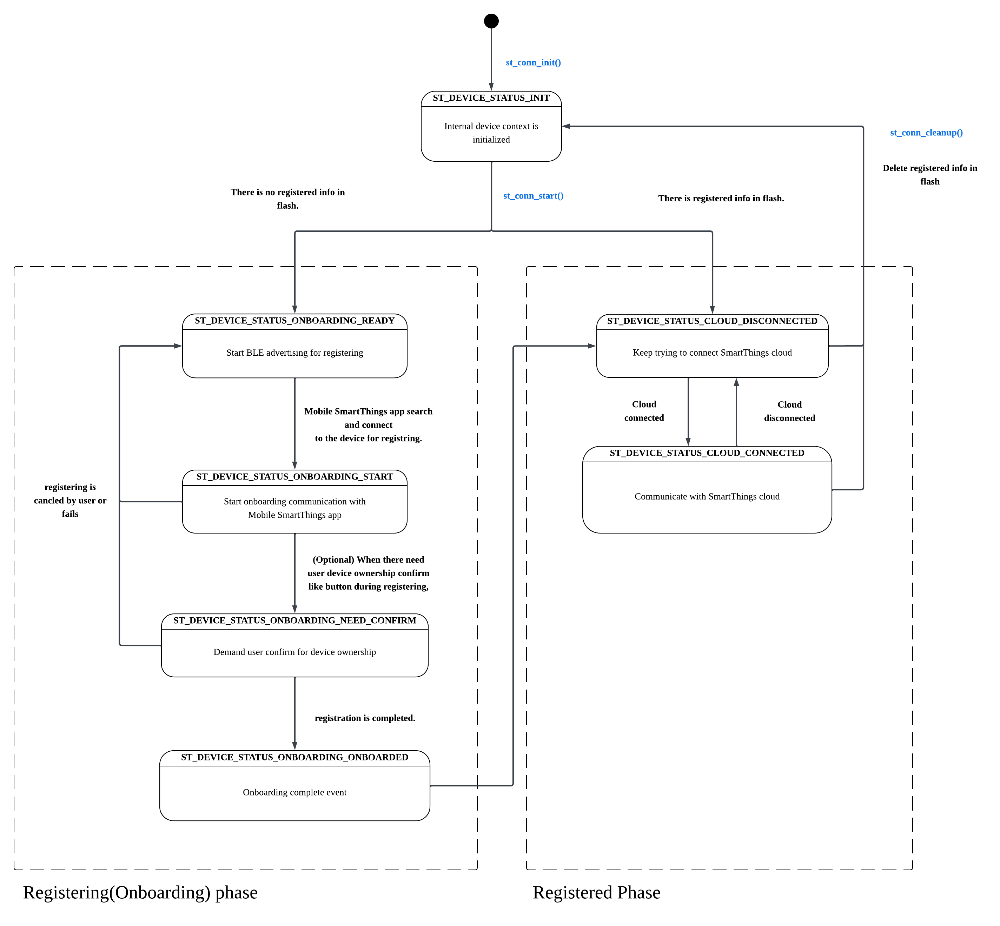

# Device State Diagram

Once a device context is initialized and started via `st_conn_init` and `st_conn_start` APIs, the device life cycle is being managed by internal SDK task. Understanding each state of the device life cycle and transfer flow can help you build better application aligned with concept of the SDK.

Device application can get the state of device via callback function registered at `st_conn_start` API.

## Device State

### ST_DEVICE_STATUS_INIT

This state is starting state of device life cycle. Internal device context is initialized.

### ST_DEVICE_STATUS_ONBOARDING_READY

This state is ready state of registering(onboarding). In the state, device start advertising BLE packet including setup data. When a user enters add device tap in SmartThings mobile app and starts searching, it can detect the BLE packet.

### ST_DEVICE_STATUS_ONBOARDING_START

When mobile SmartThings app connects to the device after searching for registration, device state changes to this state. The device and app start exchanging data according to sequence of registration.

### ST_DEVICE_STATUS_ONBOARDING_NEED_CONFIRM

In case that device onboarding step requires the user ownership confirm like pressing a button, device state changes to this state. When a application get this state, it is required to implement user confirm input method and call back `st_conn_ownership_confirm` API after confirming.

### ST_DEVICE_STATUS_ONBOARDING_ONBOARDED

When the device completes registering process and is successfully registered in the cloud, it sends this state as event. After that, device state goes to [ST_DEVICE_STATUS_CLOUD_DISCONNECTED](#st_device_status_cloud_disconnected) state.

### ST_DEVICE_STATUS_CLOUD_DISCONNECTED

In this state, the device keeps trying to connect to the SmartThings Cloud with registered info.

### ST_DEVICE_STATUS_CLOUD_CONNECTED

In this state, the application can update Capability Attributes and receive Capability Commands with the cloud. It also receives management notifications such as device deletion or device label change. Regarding updating Capability Attributes, please refer to the [Capability_Attribute_Update document](./Capability_Attribute_Update.md).
