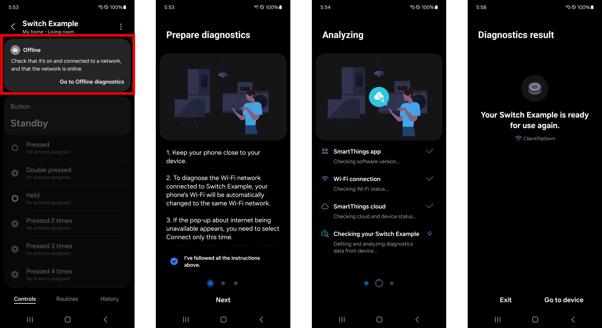

# Offline Diagnostics Guide

Offline Diagnostics is a plugin that runs on top of the SmartThings App. It helps users self-diagnose when an IoT device is detected as offline, identifies the cause, and provides recovery suggestions.

### Diagnostic Flow
1. Device List - Displays a list of detected offline devices for the user to select
    
2. Getting Everything Ready - Downloads data needed to diagnose the selected device (checks protocol version, Wi-Fi vault, device info, ownership permissions, Bluetooth/Location permissions, device capabilities, Montage resources)

3. Prepare Diagnostic - Guides the user (e.g., "Move closer to the device")

4. Change Wi-Fi - Prompts the user to connect to the same AP as the target device

5. Analyzing - Performs a 3-step diagnosis:
    - SmartThings App check: Compares installed vs. latest app version ¡æ fail = OE10

    - Wi-Fi Connection check: Signal strength (¡Â -83dBm ¡æ OE20), internet availability (unavailable ¡æ OE21)

    - SmartThings Cloud check: Endpoint response (OE30), device info API (OE31), server device health status (OE33-x), local vs. server state comparison (OE34-OE37)

6. Checking Device Connection - Monitors device status for ~100 seconds

7. Diagnostic Result - Displays results + recovery suggestions (help cards, Wi-Fi update, device restart, re-onboarding)

### Entry Points
Users can access Offline Diagnostics through three paths:
- Device Plugin: Offline device card ¡æ "Learn more" ¡æ "Go to diagnostics"
- Menu Tab: Menu ¡æ "Offline diagnostics" ¡æ Select device ¡æ "Run"
- Device Card (proposed enhancement): Direct action button on the offline device card for 1-tap access

### Offline Diagnostics in SmartThings
