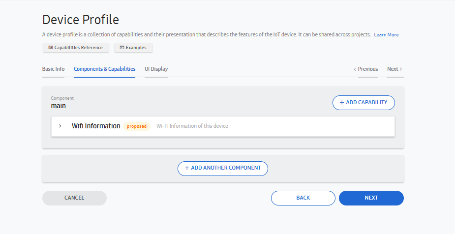
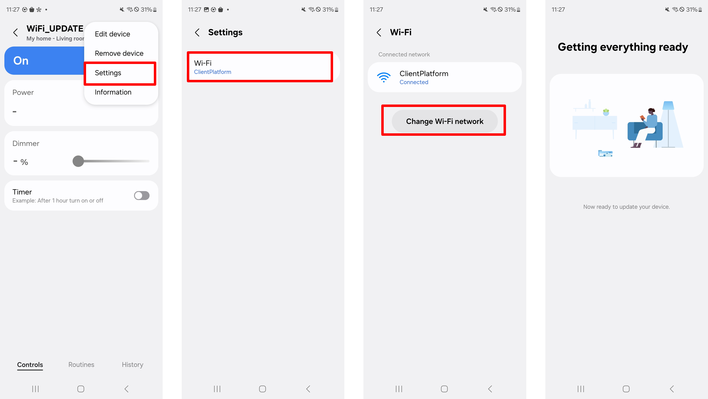
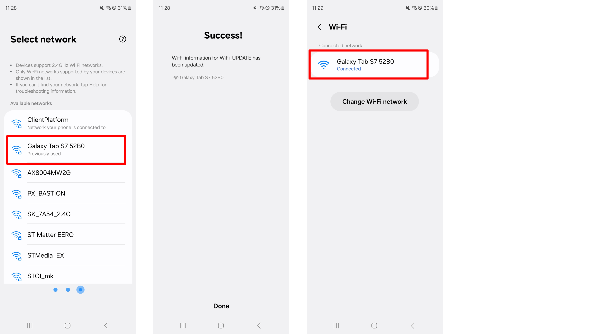

# Guide to implementing WiFi Update feature on IoT device with SmartThings SDK

In the past, there were many user complaints about SmartThings because users had to delete existing registrations and re-register devices to set up new AP connections or change the password of connected APs.
Because deleting a registration removes user settings from SmartThings, user should make the prvious settings in the SmartThings app, again.
To address this inconvenience, Samsung products support a Wi-Fi update feature that allows users to change the AP without re-registration.
STDK also provides this feature to avoid such inconvenience to users of partner products for the same reason.
SmartThings recommends to support Wi-Fi update feature for the partner products to improve user experience.
To support Wi-Fi update feature, please refer to the following guide.

### Check List to implementing WiFi Update feature
1. CONFIG_STDK_IOT_CORE_EASYSETUP_WIFI_UPDATE option enable in config file (sdkconfig). 

2. Add wifiInformation capability in Device Profile.

### WiFi Update in SmartThings

