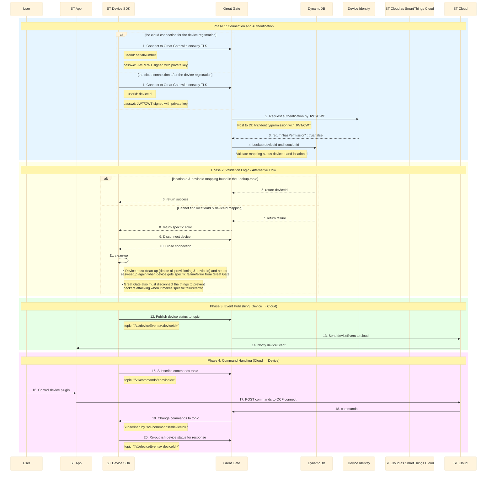

# STDK Cloud-Interface Sequence Diagram

This is the sequence diagram for the SmartThings Device SDK Cloud interface.

It illustrates the device connection, authentication, event publishing, and command handling processes.

---

## Sequence Diagram



---

## Actors

| Actor | Description |
|-------|-------------|
| **User** | End user. Initiates actions such as controlling the device plugin |
| **ST App** | SmartThings mobile application |
| **ST Device SDK** | SDK running on the device. Handles communication logic |
| **Great Gate** | Primary gateway for device communication |
| **DynamoDB** | NoSQL database. Used for lookup operations |
| **Device Identity** | Service responsible for device identity and permission management |
| **SmartThings Cloud** | Core cloud backend |

---

## Phase 1: Connection and Authentication (Step 1~4)

### Step 1: Connect to Great Gate

- **From:** ST Device SDK → Great Gate
- **Action:** Connect to SmartThings Cloud using one-way TLS for communication

> **Note:**
> ```
> Connect:
> - userid: serialNumber (before onboarding)
> - userid: deviceId (after onboarding)
> - passwd: JWT/CWT signed with private key
> ```

### Step 2: Request Authentication

- **From:** Great Gate → Device Identity
- **Action:** Request authentication by JWT/CWT

> **Note:**
> ```
> Post to DI: /v2/identity/permission with JWT/CWT
> ```

### Step 3: Return Permission Status

- **From:** Device Identity → Great Gate
- **Action:** Return authentication result
- **Data:** `'hasPermission' : true/false`

### Step 4: Lookup Matched DeviceId and LocationId

- **From:** Great Gate → DynamoDB
- **Action:** Lookup deviceId and locationId

> **Note:**
> ```
> Validate mapping status deviceId and locationId
> ```

---

## Phase 2: Validation Logic - Alternative Flow (Step 5~11)

The flow branches into two scenarios based on the lookup result in Step 4.

### Condition A: locationId & deviceId mapping found

#### Step 5: Return deviceId

- **From:** DynamoDB → Great Gate
- **Action:** `return deviceId`

#### Step 6: Connection Success

- **From:** Great Gate → ST Device SDK
- **Action:** `return success`

---

### Condition B: Cannot find locationId & deviceId mapping

#### Step 7: Return Failure

- **From:** DynamoDB → Great Gate
- **Action:** `return failure`

#### Step 8: Return Specific Error

- **From:** Great Gate → ST Device SDK
- **Action:** `return specific error`

#### Step 9: Disconnect Device

- **From:** ST Device SDK → Great Gate
- **Action:** `Disconnect device`

#### Step 10: Close Connection

- **From:** Great Gate → ST Device SDK
- **Action:** `Close connection`

#### Step 11: Clean-up

- **From:** ST Device SDK (Self-loop)
- **Action:** `clean-up`

> **Note:**
> - Device must clean-up (delete all provisioning & deviceId) and needs easy-setup again when device gets specific failure/error from Great Gate.
> - Great Gate also must disconnect the things to prevent hackers attacking when it makes specific failure/error.

---

## Phase 3: Event Publishing - Device → Cloud (Step 12~14)

### Step 12: Publish Device Status

- **From:** ST Device SDK → Great Gate
- **Action:** Publish device status to topic

> **Note:**
> ```
> topic: "/v1/deviceEvents/<deviceId>"
> ```

### Step 13: Send Event to Cloud

- **From:** Great Gate → SmartThings Cloud
- **Action:** `Send deviceEvent to cloud`

### Step 14: Notify User

- **From:** ST App → User
- **Action:** `Notify deviceEvent`

---

## Phase 4: Command Handling - Cloud → Device (Step 15~20)

### Step 15: Subscribe Commands Topic

- **From:** ST Device SDK → Great Gate
- **Action:** Subscribe commands topic

> **Note:**
> ```
> topic: "/v1/commands/<deviceId>"
> ```

### Step 16: Control Device Plugin

- **From:** User → ST App
- **Action:** `Control device plugin`

### Step 17: POST Commands

- **From:** ST App → SmartThings Cloud
- **Action:** `POST commands to OCF connect`

### Step 18: Forward Commands

- **From:** SmartThings Cloud → Great Gate
- **Action:** `commands`

### Step 19: Change Commands to Topic

- **From:** Great Gate → ST Device SDK
- **Action:** `Change commands to topic`

> **Note:**
> ```
> Subscribed by "/v1/commands/<deviceId>"
> ```

### Step 20: Re-publish Device Status (Response)

- **From:** ST Device SDK → Great Gate
- **Action:** `Re-publish device status for response`

> **Note:**
> ```
> topic: "/v1/deviceEvents/<deviceId>"
> ```

---

## MQTT Topic Summary

| Direction | Topic | Description |
|-----------|-------|-------------|
| Device → Cloud | `/v1/deviceEvents/<deviceId>` | Publish device status/events |
| Cloud → Device | `/v1/commands/<deviceId>` | Deliver commands from Cloud to device |

---

## Key Points

| Item | Description |
|------|-------------|
| **Connection Authentication** | One-way TLS + JWT/CWT signed with private key |
| **Authentication API** | `POST /v2/identity/permission` (Device Identity) |
| **Mapping Validation** | Verify deviceId & locationId mapping status in DynamoDB |
| **Failure Handling** | Delete all provisioning info and re-perform easy-setup |
| **Event Flow** | Device → Great Gate → Cloud → ST App → User |
| **Command Flow** | User → ST App → Cloud → Great Gate → Device |
