# Getting Started for Direct-connected device

SmartThings Direct-connected devices are Wi-Fi enabled devices that use the SmartThings Platform as their primary cloud infrastructure. And these devices will use the MQTT protocol for communication.

This article demonstrates how to integrate a direct-connected device with SmartThings.

&nbsp;

## Workflow

In the documents, we will show how to develop simple switch example with SmartThings SDK.

Before developing deivces, you need to register your device profile, onboarding information and device information on [Developer Workspace](https://smartthings.developer.samsung.com/workspace/projects).

And with the informaiton, you can start developing your device application with SmartThings SDK.

- [Register a Device on Developer Workspace](#register-a-device-on-developer-workspace)
- [Develop a Device Application](#develop-a-device-application)

&nbsp;

## Register a Device on Developer Workspace

First, please sign in to the [Developer Workspace](https://smartthings.developer.samsung.com/workspace/) with a Samsung Account.

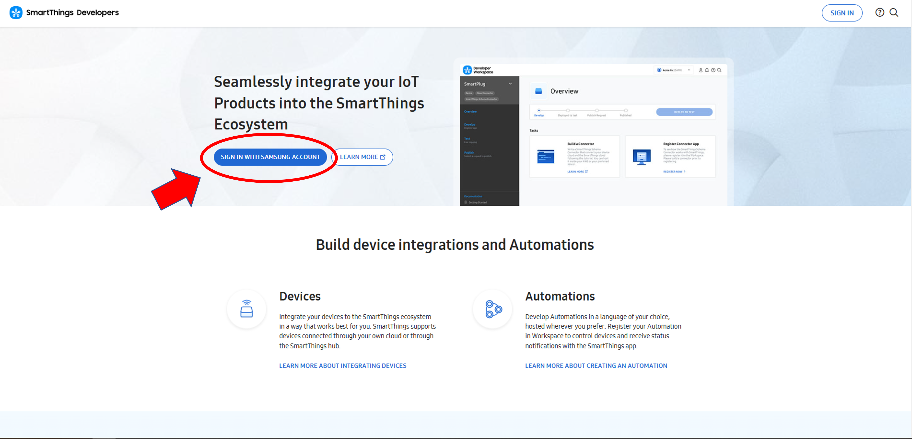

### Create a new project

To create project for direct connected device. Please select _New Project_ &rightarrow; _Device Integration_ &rightarrow; _Direct-connected_  

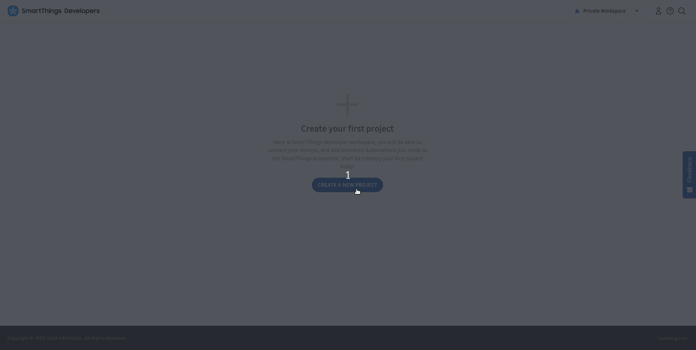


&nbsp;

### Add a device profile

A device profile contains the components, capabilities, and metadata (ID, name, etc.). This information defines the actions and attributes that an IoT device can perform.

You can find out more about SmartThings device profile at [SmartThings Device Profile](https://developer.smartthings.com/docs/devices/device-profiles).

Click the _DEFINE DEVICE PROFILE_ &rightarrow; _ADD A DEVICE PROFILE_ and then fill out required information (e.g. Basic infor, Component & Capability, UI display)

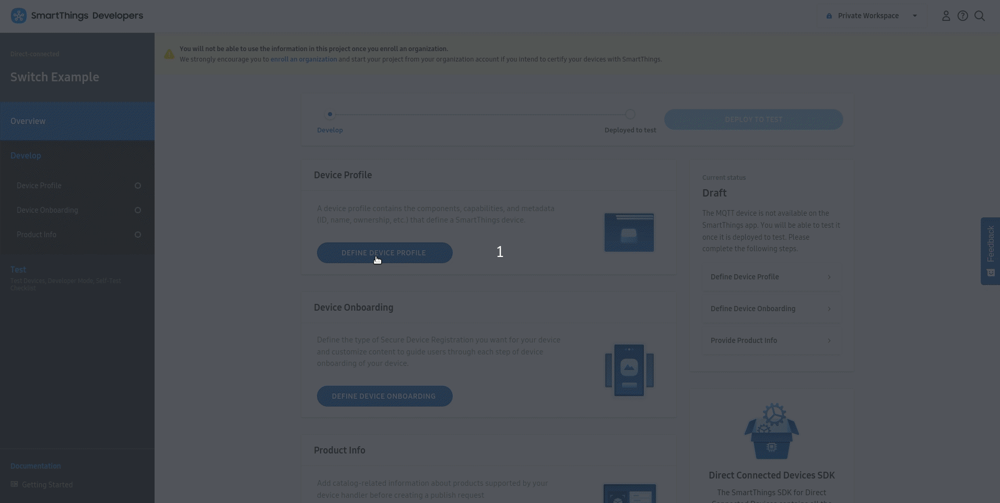

&nbsp;

The "[Health Check](https://developer.smartthings.com/docs/devices/capabilities/capabilities-reference#healthCheck)" capability is automatically added for all direct connected devices. Please leave it and add your capabilities  

&nbsp;

### Add a device onboarding

The device onboarding guides device owners when their device is first registering and connecting to SmartThings.  You can customize the screens presented by adding a device onboarding.  The ownership validation type is also defined at this stage.

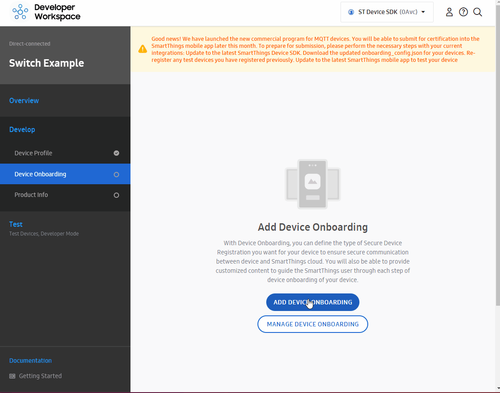

&nbsp;  


### Add a product info

The product info defines how this device is shown at SmartThings mobile app catalog. 
You can define device’s category and its regional availability.

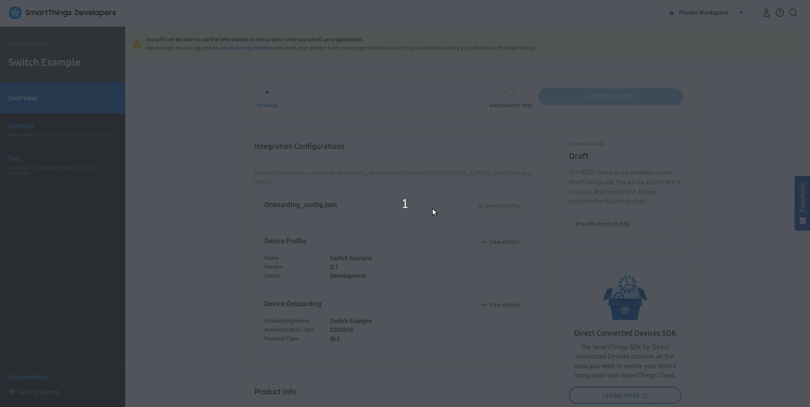  

&nbsp;  
  

### Deploy your device to test

You can start testing by deploying your device to test from _Test_ &rightarrow; _Test Devices_ or _Overview_ page.  You will be able to see your device in the SmartThings mobile app when in Developer Mode only when after it has been deployed for testing.
- [SmartThings Device Publishing Process](https://developer.smartthings.com/docs/devices/direct-connected/publish)

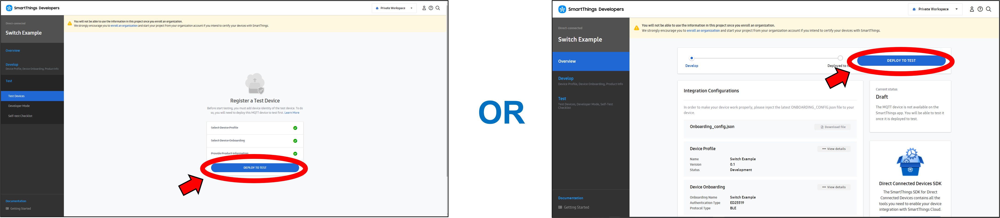

&nbsp;  

### Register test devices

You can add identity of device for authenticating your device to SmartThings cloud. This requires device information like serial number and device public key (ED25519).
Because maximum number of test device is limited per user, Once you reaches maximum number of test device, you should remove one of existing one.

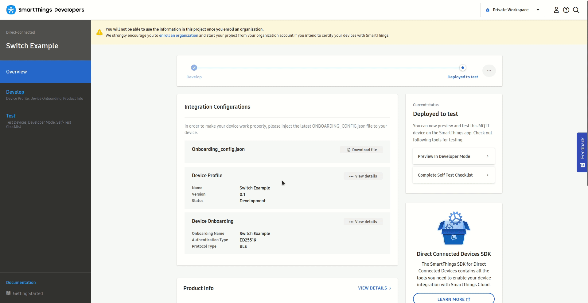

This example shows how to create ED25519 key pair with SDK tools. You can get device_info.json file as a result from tools/keygen/output_{ serialNumber}

Key generator utility (keygen.py) is located at `st-device-sdk-c/tools/keygen/`.
Serial number for testing device would be randomly generated by this tool which has STDK + 12-digit alphanumberic format.

```sh
$ cd ~/st-device-sdk-c-ref/iot-core/tools/keygen/
$ python3 stdk-keygen.py --firmware switch_example_001
Use following serial number and public key
for the identity of your device in Developer Workspace.

Serial Number:
STDK**E90W***uCX

Public Key:
nFN5x***uQusQ****ZHoBSFaAoP9***kNdLnjDJRew=
```

Copy `STDK**E90W***uCX` from keygen output and paste it into “Device serial number” field of “Register A Test Device” page.
Copy public key string from keygen output (`nFN5x***uQusQ****ZHoBSFaAoP9***kNdLnjDJRew=` in this example) and paste it into “Device Public Key” field.

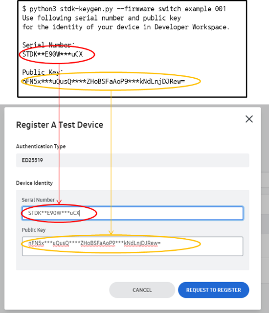

&nbsp;

### (Optional)Generate Device QR code
Using device QR code could be helpful while device onboarding. QR code should have format like below. (Please refer here for more details)

**{Your mnId}**: 4-digit alphanumeric mnId of your account  
**{Device onboardingId}**: 3-digit number Onboarding ID, you can find it from your developer workspace project “Device Onboarding” > “Other Info” page  
**{Device serialNumber}**: device serial number which is registered at your developer workspace project

```
https://qr.samsungiots.com/?m={Your mnId}&s={Device onboardingId}&r={Device serialNumber}
```

You can simply generate QR code with using below python3 script
```python
import qrcode

mnid = 'FFFF' # "FFFF" is an example. you should replace it with yours
onboardingId = '111' # "111" is an example. you should replace it with yours
serialNumber = 'STDKtest0001' # "STDKtest0001" is an example. you should replace it with yours
qrUrl = 'https://qr.samsungiots.com/?m=' + mnid + '&s=' + onboardingId + '&r=' + serialNumber
qrcode.QRCode(box_size=10, border=4)
img = qrcode.make(qrUrl)
img.save(serialNumber + '.png')
```
&nbsp;

### Download onboarding_config.json

This is the information that the IoT device must have in order to connect to the SmartThings Platform.

If you use a sample device application in example directory from this git repository, please download it and then, just overwrite the existing `onboarding_config.json` file with the new one you downloaded. In fact, overwriting is just one of several possible ways to inject it to the device. If the json information is guaranteed to be a parameter in the `st_conn_init()` function, you can refer to it differently according to your own development way.

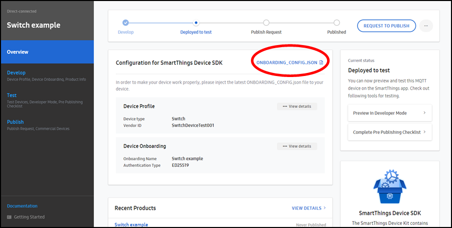

&nbsp;  
&nbsp;  

## Develop a device application

You have registered your device profile and device information, so now it is time to develop a new device application with SmartThings Device SDK.

&nbsp;

### Start from example

An easy way to get started is to branch out one of the example projects provided in the git repository. You can fine one of example from `example` directory.

&nbsp;

### Update device information

Your IoT device needs two pieces of information when connecting to the SmartThings Platform. These json formatted information should be passed to SmartThings Device SDK as a parameter of `st_conn_init()` api.

- device_info.json
- onboarding_config.json

1. device_info.json

   `device_info.json` file could contain per device specific information including firmware version, device private key, device public key and device serial number.

   We have two type of the format of `device_info.json`.

   - **All inclusive**

     `device_info.json` file could include all the information as json format. Our SmartThings Device SDK sample application uses this method.  
     This is the easiest and simplest way to contain security information for devices. But having per device specific information as json format may not be suitable for manufacturing. So this is recommended for the test devices for individual developer.
     ```json
     {
       "deviceInfo": {
         "firmwareVersion": "firmwareVersion_here",
         "privateKey": "privateKey_here",
         "publicKey": "publicKey_here",
         "serialNumber": "serialNumber_here"
       }
     }
     ```
     This file can be generated by [stdk-keygen.py](https://github.com/SmartThingsCommunity/st-device-sdk-c/tree/master/tools/keygen#individual) like below example.
     ```sh
     python3 stdk-keygen.py --firmware switch_example_ver001 --mnid fJXX
     ```

   - **Firmware version only**

     We can leave only the firmware version at `device_info.json` like below.
     ```json
     {
       "deviceInfo": {
         "firmwareVersion": "firmwareVersion_here"
       }
     }
     ```
     In this case other sercurity information like device private key, device public key and device serial number should be moved to dedicated secure partition - called as SmartThings Non-Volatile (STNV) Partition - with `CONFIG_STDK_IOT_CORE_SUPPORT_STNV_PARTITION` option enabled.  
     This is subitable for manufacturing because it could have dedicated secure partition for immutable information. SmartThings Device SDK expect security information from STNV parition with below path name.
     The mapping between `iot_nvd_t` and real storage path name can be found at `iot_bsp_nv_data_XXX.c` for [each bsp's porting layer](https://github.com/SmartThingsCommunity/st-device-sdk-c/tree/master/src/port/bsp).  
     [stdk-keygen.py](https://github.com/SmartThingsCommunity/st-device-sdk-c/tree/master/tools/keygen#commercial) also supports batch creation by reading csv formatted series of device serial number.

     | Data Path     | Description                   | Detail                              | Examples                 |
     | :------------ | :---------------------------- | :---------------------------------- | :----------------------- |
     | PublicKey     | Client (= Device) Public key  | base64 encoded ED25519 Public Key   | device.pubkey.b64        |
     | PrivateKey    | Client (= Device) Private key | base64 encoded ED25519 Privated Key | device.seckey.b64        |
     | SerialNum     | Device Serial Number          | alphanumberic string (8~30)         | SN12345678F              |

     > **Note :**
     >
     > If `CONFIG_STDK_IOT_CORE_SUPPORT_STNV_PARTITION` option has enabled, SmartThings Device SDK ignores `privateKey`, `publicKey` and `serialNumber` field from `device_info.json` file

2. onboarding_config.json

   The `onboarding_config.json` contains project common information. this can be downloaded from Developer Workspace project page as a file. Our sample appliation embedding it as an object blob. But developer could decide how to embed it as a part of device firmware.
   ```json
   {
     "onboardingConfig": {
       "deviceOnboardingId": "NAME",
       "mnId": "MNID",
       "setupId": "999",
       "vid": "VID",
       "deviceTypeId": "TYPE",
       "ownershipValidationTypes": [
         "JUSTWORKS",
         "BUTTON",
         "PIN",
         "QR"
       ],
       "identityType": "ED25519",
       "deviceIntegrationProfileKey": {
         "id": "DIP_UUID",
         "majorVersion": 0,
         "minorVersion": 1
       }
     }
   }
   ```
  
&nbsp;

### Develop device application

A device application is developed using the APIs provided by the IoT Core Device Library.

Major APIs are like below:

- connection management
  - st_conn_init()
  - st_conn_set_noti_cb()
  - st_conn_start()
  - st_conn_cleanup()
  - st_conn_ownership_confirm()

- capability management
  - st_cap_handle_init()
  - st_cap_cmd_set_cb()
  - st_cap_create_attr()
    - ST_CAP_CREATE_ATTR_NUMBER
    - ST_CAP_SEND_ATTR_NUMBER
    - ST_CAP_CREATE_ATTR_STRING
    - ST_CAP_SEND_ATTR_STRING
    - ST_CAP_CREATE_ATTR_STRINGS_ARRAY
    - ST_CAP_SEND_ATTR_STRINGS_ARRAY
  - st_cap_free_attr()
  - st_cap_send_attr()

***Main function example for ESP32*** :

```sh
void app_main(void)
{
    /**
      SmartThings Device SDK aims to make it easier to develop IoT devices by providing
      additional st_iot_core layer to the existing chip vendor SW Architecture.

      That is, you can simply develop a basic application
      by just calling the APIs provided by st_iot_core layer like below.

      // create a iot context
      1. st_conn_init();

      // create a handle to process capability
      2. st_cap_handle_init(); (called in function 'capability_init')

      // register a callback function to process capability command when it comes from the SmartThings Server.
      3. st_cap_cmd_set_cb(); (called in function 'capability_init')

      // process on-boarding procedure. There is nothing more to do on the app side than call the API.
      4. st_conn_start(); (called in function 'connection_start')
     */

    unsigned char *onboarding_config = (unsigned char *) onboarding_config_start;
    unsigned int onboarding_config_len = onboarding_config_end - onboarding_config_start;
    unsigned char *device_info = (unsigned char *) device_info_start;
    unsigned int device_info_len = device_info_end - device_info_start;

    int iot_err;

    // create a iot context
    ctx = st_conn_init(onboarding_config, onboarding_config_len, device_info, device_info_len);
    if (ctx != NULL) {
        iot_err = st_conn_set_noti_cb(ctx, iot_noti_cb, NULL);
        if (iot_err)
            printf("fail to set notification callback function\n");
    } else {
        printf("fail to create the iot_context\n");
    }

    // create a handle to process capability and initialize capability info
    capability_init();

    iot_gpio_init();
    register_iot_cli_cmd();
    uart_cli_main();
    xTaskCreate(app_main_task, "app_main_task", 4096, NULL, 10, NULL);

    // connect to server
    connection_start();
}

```

&nbsp;

### Build the App

There are README files in each example foler. And it explains how to build the example in each chipset environment with SmartThings Device SDK.

&nbsp;

### Test

The SmartThings App should be used to control an IoT device that is running with the SmartThings Platform. Go to application market place (e.g. Play Store, App Store, Galaxy Store) and download the SmartThings app on your mobile device.

1. **Enable developer mode**  
You need to enable the ***Developer Mode*** in the SmartThings app before start testing.  
Please refer [here](https://developer.smartthings.com/docs/devices/direct-connected/test-your-device-app) for more details.  
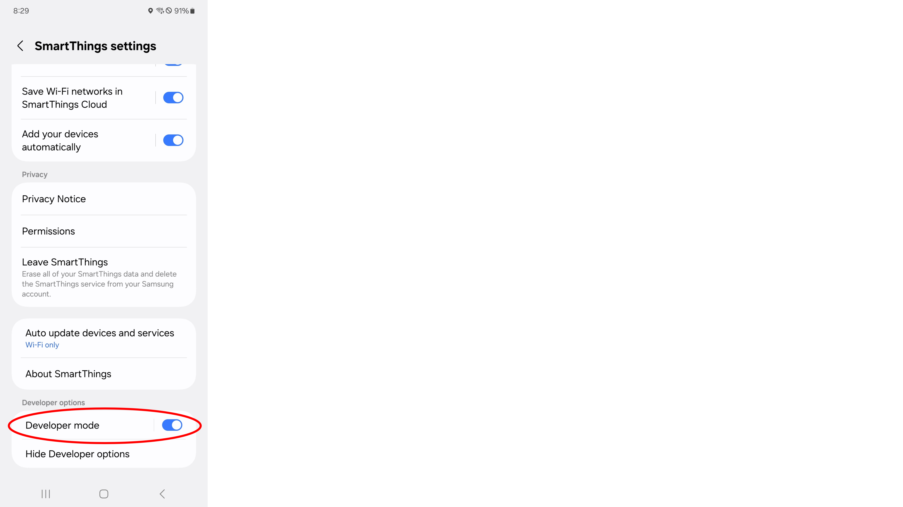

2. **Add device**  
Go to ***Add device*** and click ***My Testing Devices*** or ***Scan QR code***. You can now see and add your self-published devices.  
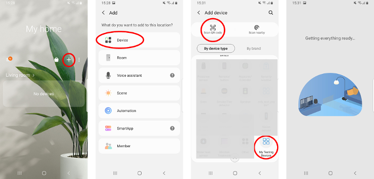
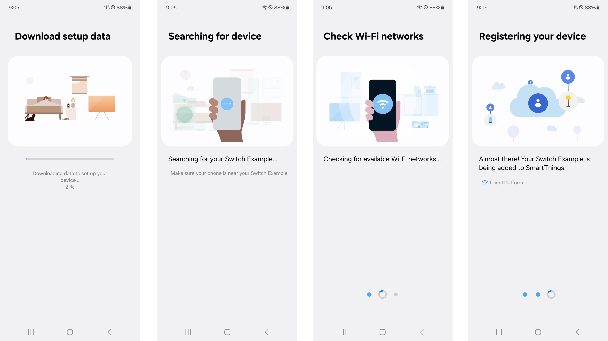

3. **Control device**  
You can control test device from dash board action and device plug user interface  
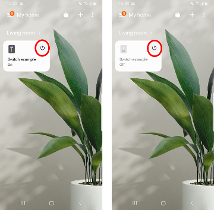
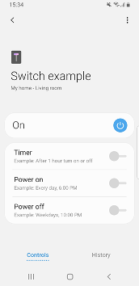
