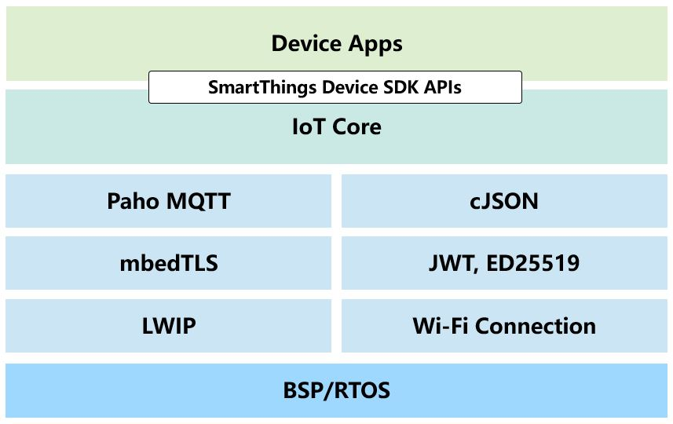

# SmartThings Device SDK Porting Guide

This document explains how you can port the SmartThings Device SDK(STDK for short) for C to a new chipset platform.

## Build system

By default, the STDK uses the build system of the chipset vendor, so you must install the toolchain provided by the vendor of the chipset that you want to develop.

- **Example for ESP32**

  ESP32 supports multiple host environments including Windows, Linux, and macOS. Based on experience, compile times are significantly faster on Linux but it is up to you which environment you prefer to use. Anyway, in this document, we will describe this on Linux. If you want to use other environments, please refer to the [chipset vendor's guides](https://docs.espressif.com/projects/esp-idf/en/latest/esp32/get-started/index.html).

  1. Get STDK source code

     There are two git repositories for working with the SmartThinks SDK. One git repository has the core Internet of Things (IoT) library while the second git repository has example device applications.

     - [IoT Core Device Library](https://github.com/SmartThingsCommunity/st-device-sdk-c)
     - [Reference](https://github.com/SmartThingsCommunity/st-device-sdk-c-ref)

     From the terminal, navigate to the directory you want the STDK to live and clone it using the following git command:

     ```sh
     cd ~
     git clone https://github.com/SmartThingsCommunity/st-device-sdk-c.git
     git clone https://github.com/SmartThingsCommunity/st-device-sdk-c-ref.git
     ```

  2. Get chipset SDK

     Download an original chipset SDK you want to port

     ```sh
     mkdir -p ~/esp
     cd ~/esp
     git clone --recursive https://github.com/espressif/esp-idf.git
     ```

  3. Setup build environment

     Now you have to choose whether to configure the build environment as a chipset SDK-based or STDK-based.
  
     If you want to configure a build environment based on chipset SDK, you can place the IoT core device library into `~/esp/esp-idf/components/` . From now on, it's more helpful to see the chipset vendor's guides for more details.

     Here, l will explain setting up a build environment based on the STDK [reference git repository](https://github.com/SmartThingsCommunity/st-device-sdk-c-ref).

     Place the IoT core device library and the chipset SDK into reference git repository.

     ```sh
     #Place the IoT core device library into reference(examples) git repository.
     cd ~
     cp -r ./st-iot-device-sdk-c/* ./st-device-sdk-c-ref/iot-core/
      
     #Place the chipset SDK into reference(examples) git repository.
     cd ~/st-device-sdk-c-ref/bsp
     mkdir esp32
     cp -r ~/esp/esp-idf/* ./esp32/
     ```

     After porting, you can register this job as git submodules and do it easily.

  4. Set up the tools

     Aside from the ESP-IDF, you also need to install the tools used by ESP-IDF, such as the compiler, debugger, Python packages, etc.

     ```sh
     cd ~/esp32
     ./install.sh esp32
     ```

  5. Make a build script.

     Please refer to the pre-supplied scripts(such as `build.sh`, `build_esp32.sh`) that ported on the ESP32 board using freeRTOS for easier understanding.

     ```sh
     cd ~/st-device-sdk-c-ref
     tree
     .
     |-- ......
     |-- build.sh
     |-- ......
     |-- setup.sh
     `-- tools
         |-- ......
         |-- esp32
         |   |-- build_esp32.sh
         |   |-- ......
         |   `-- setup_esp32.sh
         |-- ......
     ```


## Directory layout

Like other SDKs, the STDK have platform-dependent and platform-independent directories. The platform-dependent directories that must be ported have been marked in Bold as shown below.

- apps : sample device applications for each chipset
- bsp : original chipset vendor's SDKs will be copied here
- doc : documents
- **iot-core** : IoT core device library will be copied here
  - src
    - include : there are declarations of functions to be ported
    - **port** : add a new directory that you want to port
      - **bsp**
        - **esp32**
        - **posix**
        - **{new chipset}**
      - **net**
        - **mbedtls**
        - **openssl**
        - **{new library}**
      - **os**
        - **freertos**
        - **posix**
        - **{new OS}**
    - ......
  - ......
- output : build outputs will be placed
- patches : patches to be applied in the original chipset vendor's SDK for resolving some problems
- tools : scripts to be applied for each chipset

If you port a new chipset or OS, please submit or inform your porting results to merge [IoT core device library git repo](https://github.com/SmartThingsCommunity/st-device-sdk-c).

## Porting

The IoT core device library has a porting layer to support the use of the same APIs in the device application, even if the platform changes. In the current STDK version, the platform-dependent directories that must be ported are present in the `src/port/bsp`, `src/port/net` and `src/port/os` of [IoT core device library git repo](https://github.com/SmartThingsCommunity/st-device-sdk-c).



### BSP(Board Support Package)

The BSP is the well-defined set of functions that the IoT core device library invokes in order to interact with a platform's specific networking, file IO, random number generator, and system feature.

In other words, porting APIs which are ported are designed to be implemented only for the functions required by the IoT core device library. Currently, there are 21 APIs to be ported by each hardware architecture.

For additional information about API parameters, please refer to the [API document](https://github.com/SmartThingsCommunity/st-device-sdk-c/blob/master/doc/STDK_APIs.pdf).

#### File system

| APIs                                                         | Description                                                  |
| ------------------------------------------------------------ | ------------------------------------------------------------ |
| iot_error_t iot_bsp_fs_close( iot_bsp_fs_handle_t  handle )  | Close a file.                                                |
| iot_error_t iot_bsp_fs_deinit  (  )                          | Deinitialize a file system.                                  |
| iot_error_t iot_bsp_fs_init  (  )                            | Initialize a file system. <br/>This function initialize the file-system of the device. You must call this function before using file-management function (open, read, write, etc.) |
| iot_error_t iot_bsp_fs_open  ( const char *  filename, iot_bsp_fs_open_mode_t  mode,    iot_bsp_fs_handle_t *  handle ) | Open a file.                                                 |
| iot_error_t iot_bsp_fs_read  ( iot_bsp_fs_handle_t  handle, char *  buffer,   size_t * length ) | Read a file.                                                 |
| iot_error_t iot_bsp_fs_remove  ( const char *  filename )    | Remove a file.                                               |
| iot_error_t iot_bsp_fs_write  ( iot_bsp_fs_handle_t  handle, const char *  data, size_t  length ) | Write a file.                                                |

#### Non-volatile storage

| APIs                                                         | Description                                                  |
| ------------------------------------------------------------ | ------------------------------------------------------------ |
| const char* iot_bsp_nv_get_data_path  ( iot_nvd_t  nv_type ) | Get a nv data path. <br/>This function will return the nv data path. The detail of data path is depend on the file-system type.<br/>ex)<br/> : espressif nvs-system - nvs key ("nvItemKey") <br/> : Linux file-system - file path ("/stnv/nvItemKey") |

#### Random number

| APIs                              | Description                                                  |
| --------------------------------- | ------------------------------------------------------------ |
| unsigned int iot_bsp_random  (  ) | Generate random number. <br/>This function generate and return random number. |

#### System

| APIs                                                         | Description                |
| ------------------------------------------------------------ | -------------------------- |
| iot_error_t iot_bsp_system_get_time_in_sec  ( char *  buf, unsigned int  buf_len ) | Get system time in second. |
| iot_error_t iot_bsp_system_get_uniqueid  ( unsigned char **  uid, size_t *  olen ) | Get device unique value.   |
| void iot_bsp_system_poweroff  (  )                           | Shutdown system.           |
| void iot_bsp_system_reboot  (  )                             | Restart system.            |
| iot_error_t iot_bsp_system_set_time_in_sec  ( const char *  time_in_sec ) | Set system time in second. |
| const char *iot_bsp_get_bsp_name  (  )                       | Get bsp name.              |
| const char *iot_bsp_get_bsp_version_string  (  )             | Get bsp version string.    |

#### Wi-Fi

| APIs                                                         | Description                                                  |
| ------------------------------------------------------------ | ------------------------------------------------------------ |
| iot_wifi_freq_t iot_bsp_wifi_get_freq  ( void   )            | Get the Wi-Fi Frequency band.                                |
| iot_error_t iot_bsp_wifi_get_mac  ( struct iot_mac *  wifi_mac ) | Get the Wi-Fi MAC.                                           |
| uint16_t iot_bsp_wifi_get_scan_result  ( iot_wifi_scan_result_t *  scan_result ) | Get the AP scan result.                                      |
| iot_error_t iot_bsp_wifi_init  (  )                          | Initialize Wi-Fi function.                                   |
| iot_error_t iot_bsp_wifi_set_mode  ( iot_wifi_conf *  conf ) | This function set the wifi operating mode as scan, station and softap |
| iot_error_t iot_bsp_wifi_register_event_cb(iot_bsp_wifi_event_cb_t cb) | This function set Wi-Fi event callback such as IOT_WIFI_EVENT_SOFTAP_STA_JOIN, IOT_WIFI_EVENT_SOFTAP_STA_LEAVE |
| void iot_bsp_wifi_clear_event_cb(void)                       | This function clears registered Wi-Fi event callback         |
| iot_wifi_auth_mode_bits_t iot_bsp_wifi_get_auth_mode(void)   | This function returns wifi auth mode support bits            |

#### BLE

| APIs                                                         | Description                                                  |
| ------------------------------------------------------------ | ------------------------------------------------------------ |
| void iot_bsp_send_indication(uint8_t *buf, uint32_t len)     | Send indication.                                             |
| void iot_bsp_create_advertise_packet(char *mnid, char *setupid, char *serial) | Create Advertise packet.                                     |
| void iot_bsp_create_scan_response_packet(char *device_onboarding_id, char *serial) | Create Scan Response packet.                               |
| void iot_bsp_gatt_init(void)                                 | Initialize Gatt function.                                     |
| void iot_bsp_ble_init(CharWriteCallback cb)                  | Initialize BLE function.                                      |
| void iot_bsp_ble_deinit(void)                                | De-initizlize BLE function.                                   |
| uint32_t iot_bsp_ble_get_mtu(void)                           | Get MTU size.                                                 |

#### Debug

| APIs                                                         | Description                                                  |
| ------------------------------------------------------------ | ------------------------------------------------------------ |
| void iot_bsp_debug  ( iot_debug_level_t  level,  <br/>  const char *  tag,  <br/>  const char *  fmt,  <br/>    ...  <br/> ) | Write message into the log. <br/>This function is not intended to be used directly. Instead, use one of IOT_ERROR, IOT_WARN, IOT_INFO, IOT_DEBUG macros. |
| void iot_bsp_debug_check_heap  ( const char *  tag,  <br/>  const char *  func,  <br/>  const int  line,  <br/>  const char *  fmt,  <br/>    ...  <br/> ) | Check memory(heap) status.                                   |

### Network

A Network layer provides the STDK with TLS communication using various TLS/SSL libraries.
The SmartThings does not support non-TLS communication.

A network interface instance is created via the [`iot_net_init`](https://github.com/SmartThingsCommunity/st-device-sdk-c/blob/master/src/include/iot_easysetup.h#L78) function.
And the library specific parameter must be implemented in [`iot_net_platform_context_t context`](https://github.com/SmartThingsCommunity/st-device-sdk-c/blob/master/src/include/iot_easysetup.h#L53).

#### Existing implementations
- [`iot_net_mbedtls.c`](https://github.com/SmartThingsCommunity/st-device-sdk-c/blob/master/src/port/net/mbedtls/iot_net_mbedtls.c)
- [`iot_net_openssl.c`](https://github.com/SmartThingsCommunity/st-device-sdk-c/blob/master/src/port/net/openssl/iot_net_openssl.c)

### OS

These APIs are related to operating system.

#### Utils

| APIs                                                         | Description                                                  |
| ------------------------------------------------------------ | ------------------------------------------------------------ |
| void iot_os_delay  ( unsigned int  delay_ms )                | This function will delay thread for given time               |
| unsigned int iot_os_eventgroup_clear_bits  ( iot_os_eventgroup *  eventgroup_handle,  <br/>  const unsigned char  bits_to_clear ) | This function will clear bit/bits of eventgroup              |
| iot_os_eventgroup* iot_os_eventgroup_create  ( void   )      | This function create eventgroup and return eventgroup handle |
| void iot_os_eventgroup_delete  ( iot_os_eventgroup *  eventgroup_handle ) | This function delete eventgroup                              |
| unsigned int iot_os_eventgroup_set_bits  ( iot_os_eventgroup *  eventgroup_handle,  <br/>  const unsigned char  bits_to_set ) | This function will set bit/bits of eventgroup                |
| unsigned char iot_os_eventgroup_wait_bits  ( iot_os_eventgroup *  eventgroup_handle,  <br/>  const unsigned char  bits_to_wait_for,  <br/>  const int  clear_on_exit,  <br/>  const unsigned int  wait_time_ms ) | This function will wait for bit of group of bits to become set |
| int iot_os_mutex_init  ( iot_os_mutex *  mutex )             | This function will create mutex                              |
| int iot_os_mutex_lock  ( iot_os_mutex *  mutex )             | This function will lock mutex before critical section        |
| int iot_os_mutex_unlock  ( iot_os_mutex *  mutex )           | This function will unlock mutex after critical section       |
| iot_os_queue* iot_os_queue_create  ( int  queue_length,  <br/>  int  item_size ) | This function create queue and return queue handle           |
| void iot_os_queue_delete  ( iot_os_queue *  queue_handle )   | This function delete queue                                   |
| int iot_os_queue_receive  ( iot_os_queue *  queue_handle,  <br/>  void *  data,  <br/>  unsigned int  wait_time_ms ) | This function will receive item from the front of queue      |
| int iot_os_queue_reset  ( iot_os_queue *  queue_handle )     | This function reset queue                                    |
| int iot_os_queue_send  ( iot_os_queue *  queue_handle,  <br/>  void *  data,  <br/>  unsigned int  wait_time_ms ) | This function will send item to the back of queue            |
| int iot_os_thread_create  ( void *  thread_function,  <br/>  const char *  name,  <br/>  int  stack_size,  <br/>  void *  data,  <br/>  int  priority,  <br/>  iot_os_thread *  thread_handle ) | This function create and run thread                          |
| void iot_os_thread_delete  ( iot_os_thread  thread_handle )  | This function delete thread                                  |
| void iot_os_thread_yield  (  )                               | This function yields task                                    |
| void iot_os_timer_count_ms  ( iot_os_timer  timer,  <br/>  unsigned int  timeout_ms ) | This function will set timer count in ms unit.               |
| void iot_os_timer_destroy  ( iot_os_timer *  timer )         | This function will destroy timer struct                      |
| void iot_os_timer_init  ( iot_os_timer *  timer )            | This function will init timer struct                         |
| char iot_os_timer_isexpired  ( iot_os_timer  timer )         | This function will check if timer is expired                 |
| unsigned int iot_os_timer_left_ms  ( iot_os_timer  timer )   | This function will return remaining time in ms unit          |
| const char *iot_os_get_os_name  ( )                          | This function will return name of os                         |
| const char *iot_os_get_os_version_string  ( )                | This function will return version string of os               |

