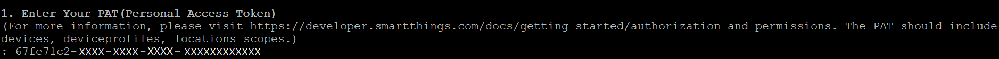
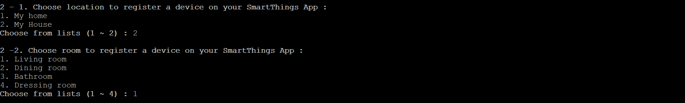
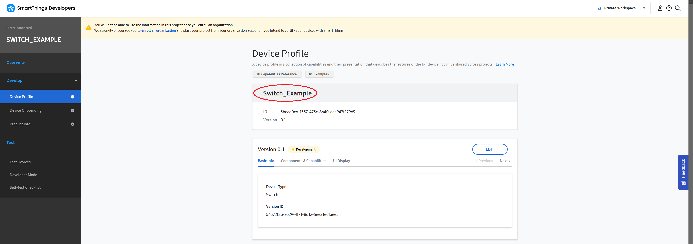
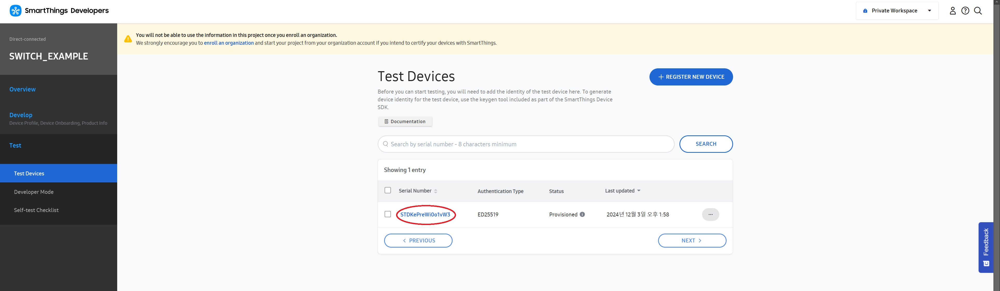
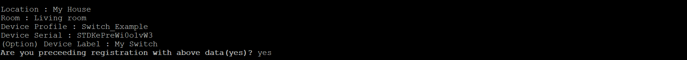
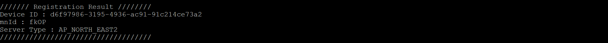
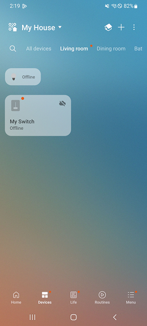

# Manual Onboarding Script Tool

[](LICENSE)

## Summary

This script tool provides way to register a device manually on SmartThings platform instead of a real device onboarding process.
So, you can build fast prototype SmartThings IoT application using the SDK on your desktop environment without real device board.

## Remark

This tool is provided to aim to help fast PoC bring-up and development. After checking functional feasibility, you need to test it on real device from onboarding process.

## Prerequisites

* User PAT (Personal Access Token) with devices, deviceprofiles, location scope. (Refer [How To Generate PAT](https://developer.smartthings.com/docs/getting-started/authorization-and-permissions))
* Registered Device Profile and Test Devices identity (Please read [How To Register a Device on Developer Workspace](../../doc/getting_started.md#register-a-device-on-developer-workspace))

## Usage

```sh
stdk-onboarding.py
```

### Example

1. Enter your PAT. If you don't have it, please generate one with devices, deviceprofiles, locatio scope. (Refer [How To Generate PAT](https://developer.smartthings.com/docs/getting-started/authorization-and-permissions))



2. Choose location and room to register a device on your SmartThings App.



3. Choose device profile of the device. (You can find your device profile name on Developer Workspace. Click the _Device Profile_ under _Develop_ tab on your Project. Please refer [Getting Started](../../doc/getting_started.md#register-a-device-on-developer-workspace) document.)




4. Enter serial number for the device. You should enter registered serial number on your developer Workspace. (You can find registered device serial number in _Test Devices_ under _Test_ tab. Please refer [Getting Started](../../doc/getting_started.md#register-a-device-on-developer-workspace) document.)




5. Enter device label to show on SmartThings App. If you skip, default device label is device profile name.


6. Review registration info before proceeding.



7. Result of registration. You can get device id for registered device on SmartThings platform.



### Result

On SmartThings App


