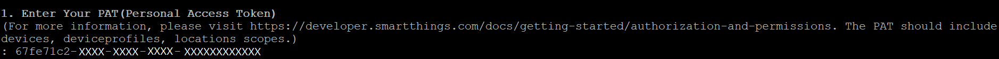
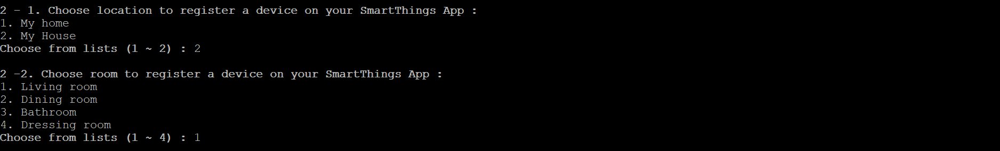
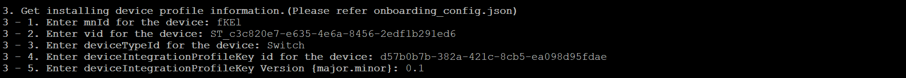
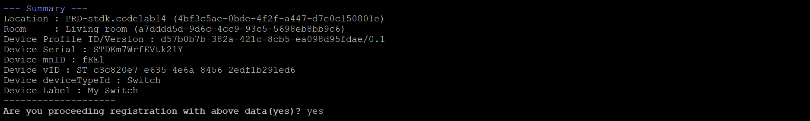
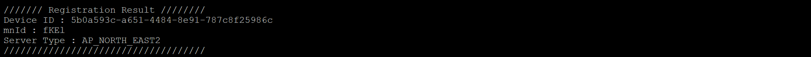
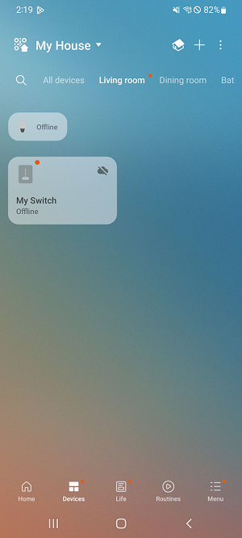

# Manual Onboarding Script Tool

[](LICENSE)

## Summary

This script tool provides a way to register a device manually on the SmartThings platform without going through the real device onboarding process.
This allows you to build a fast prototype SmartThings IoT application using the SDK on your desktop environment without a real device board.

## Remark

This tool is designed to help accelerate PoC bring-up and development. Once you have verified functional feasibility, you need to test it on a real device through the onboarding process.

## Prerequisites

* User PAT (Personal Access Token) with devices, deviceprofiles, location scope. (Refer [How To Generate PAT](https://developer.smartthings.com/docs/getting-started/authorization-and-permissions))
* Registered Device Profile and Test Device identities (Please read [How To Register a Device on Developer Center](../../doc/getting_started.md#register-a-device-on-smartthings-developer-center))

## Usage

```sh
stdk-manual-onboarding.py
```

### Example

1. Enter your PAT. If you don't have it, please generate one with devices, deviceprofiles, location scope. (Refer [How To Generate PAT](https://developer.smartthings.com/docs/getting-started/authorization-and-permissions))



2. Choose location and room to register a device on your SmartThings App.



3. Input device profile information. (You can check your device profile information in Onboarding Config file. To download Onboarding Config file, please refer [Getting Started](../../doc/getting_started.md#download-onboarding_configjson) document)



4. Enter serial number for the device. You should enter a registered serial number in your Developer Center. (You can check registered device serial number in _Test Devices_ page on Developer Center. Please refer [Getting Started](../../doc/getting_started.md#register-test-devices) document.)


5. Enter device label to show on SmartThings App. If you skip, default device label is device profile name.


6. Review registration info before proceeding.



7. Result of registration. You can get device id for registered device on SmartThings platform.



8. Go to the [posix example](../../example/posix/README.md) and execute it with the above information.

### Result

On the SmartThings App


